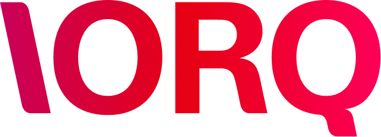

  

# Sobre a IORQ
A **IORQ** é uma plataforma de crédito inteligente que orquestra todas as etapas do ciclo de crédito — da originação ao funding, passando pela estruturação de operações, análise de risco, gestão de garantias e conexão com investidores.

Com mais de **R$ 2,5 bilhões em ativos sob gestão**, a empresa une uma base sólida de execução a uma infraestrutura tecnológica proprietária, desenhada para escalar com segurança.
A IORQ já opera com estruturas reguladas, como FIDCs, e mantém parcerias com instituições licenciadas, atendendo empresas B2B e B2B2C que buscam criar ou expandir suas operações de crédito de forma digital, integrada e escalável.

---

# Manifesto
No ritmo das grandes cidades, dos negócios, das mudanças.

Inspirada pela beleza do movimento, da criatividade, das melodias inesquecíveis.

**IORQ** é uma plataforma de crédito que devolve às empresas o controle sobre financiar, operar e crescer através da tecnologia, como se fosse música.

Investimentos regidos por velocidade, transparência, e impacto.

Tudo junto e orquestrado.

**IORQ. Investimentos Orquestrados**

---

# Propósito
Existimos para orquestrar o crédito entre tomadores e investidores.

# Missão
Descentralizar o crédito privado no Brasil com tecnologia e maestria.

# Visão
Transformar a produtividade da economia brasileira.

---

# 1. CLAREZA PLENA
Comunicar em alto e bom som é a base da confiança e do sucesso. Para quem investe, para quem toma, e para quem trabalha na IORQ.

**Comportamentos esperados:**
- Compartilha decisões, contextos e riscos com clareza, garantindo que todas as pessoas envolvidas, independente de nível hierárquico, estejam alinhadas e saibam o que se espera delas.
- Toma a iniciativa de conduzir conversas difíceis, colocando temas relevantes na mesa de forma construtiva e transparente.
- Mantém uma perspectiva independente, se engaja e expressa discordância quando necessário.

---

# 2. PERFORMANCE E DEDICAÇÃO
Cultura de resultados: entrega e execução precisa do que foi ensaiado, com controle e ambição.

**Comportamentos esperados:**
- Assume a responsabilidade por entregar com excelência, tratando prazos e combinados com seriedade.
- Analisa os impactos de seu trabalho e as iniciativas que lidera, com base em dados e conectado com a estratégia da companhia.
- Apresenta consistência em tudo que faz.

---

# 3. AFINAÇÃO PERFEITA
Somos um só time. A força da IORQ está na colaboração entre as pessoas e na sintonia entre todas as áreas.

**Comportamentos esperados:**
- Colabora ativamente com outras áreas para resolver problemas em conjunto, de forma não hierárquica e inclusiva.
- Dá e recebe feedback com maturidade e respeito, buscando melhorar a sintonia e fortalecer o time como um todo.
- Desenvolve ativamente outros membros do time.

---

# 4. CRIAR, COMPOR E TRANSFORMAR
A inovação que interessa é a que automatiza, escala e elimina o ruído.

**Comportamentos esperados:**
- Questiona o status quo e propõe soluções eficientes e escaláveis, mesmo que ainda imperfeitas.
- Testa novas ideias com agilidade, aprende com os erros e incorpora melhorias com foco em impacto real.
- Faz escolhas entre impacto de curto e longo prazo no dia a dia.

---

# 5. OUVIDO ABSOLUTO
O atendimento na IORQ é uma experiência fluida, precisa e com impacto real.

**Comportamentos esperados:**
- Observa os mais altos padrões de serviço e ética em toda interação com o cliente, seja escrita, verbal, presencial ou remota.
- Antecipadamente identifica ruídos ou fricções na jornada dos clientes para eliminá-los com precisão e agilidade.
- Representa bem a companhia em todos os momentos, seja durante o trabalho, seja fora.
